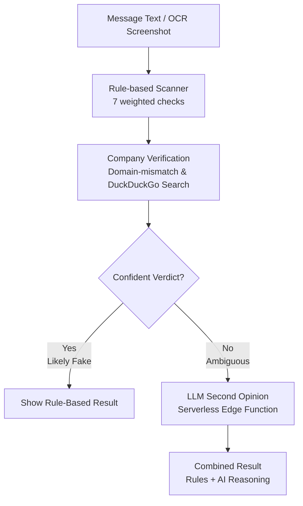

# ScamRadar for Interns 🛡️

> A privacy-first, zero-latency tool designed to help students instantly detect whether a WhatsApp-forwarded internship offer is genuine or a scam.

Every semester, thousands of first- and second-year engineering students receive forwarded internship offers on WhatsApp. Often, these messages lack a verifiable sender or company website, and occasionally, they demand a "registration fee" or sensitive personal documents before any real interview takes place. **ScamRadar for Interns** provides a quick, reliable way to verify these offers before responding.

---

## ⚡ How It Works

Paste the message text (or upload a screenshot), and ScamRadar analyzes it using a powerful dual-layer architecture:

### 1. Rule-Based Engine (Zero-Latency)
The primary scanner instantly checks for the most damaging scam patterns:
- Upfront payment or "refundable deposit" requests.
- Personal email domains (`@gmail.com`) posing as corporate recruiters.
- Artificial urgency and high-pressure tactics.
- Vague role descriptions paired with unrealistic stipends.
- Unwarranted requests for sensitive information (Aadhaar, PAN, bank details).

### 2. AI Second-Opinion Layer (Fallback)
For cases where the rule-based engine cannot confidently classify the message, it is securely sent to an LLM (powered by Groq) for a structured second read. This layer catches nuanced phrasing and subtle intent that strict regex rules might miss.

> [!IMPORTANT]
> **Privacy First:** The rule-based layer runs first and handles the vast majority of cases locally. Your input never leaves your device unless the AI second-opinion layer specifically needs to run for an ambiguous case—and this is explicitly disclosed in the UI.

---

## 🏗️ Architecture & Engineering Decisions

**Stateless & Client-Side by Default**
No user accounts, no message storage, and no tracking. Everything runs in the browser to protect student privacy. 

**Honest About Its Limits**
Early validation revealed that a pure rule-based scanner has a hard ceiling. While it reliably catches 100% of known scam patterns (like advance-fee fraud), it can miss novel phrasing. Rather than overpromising, ScamRadar labels a clean verdict as `"No Red Flags Found"` instead of `"Genuine"`, paired with a persistent UI disclaimer.

**The Hybrid Approach**
The rule-based engine achieved a 0% false-positive rate on our validation sets but missed highly specific synonym variations in holdout testing. The LLM layer specifically targets this gap—handling the phrasing variation that regex structurally cannot—without sacrificing the speed and privacy of running rules-only for obvious cases.

### Flow Diagram



---

## 🛠️ Tech Stack

- **Frontend:** React 19, Vite, Tailwind CSS 4
- **OCR:** `Tesseract.js` (with canvas-based grayscale/contrast preprocessing for accurate WhatsApp screenshot extraction).
- **AI Layer:** Groq API (`openai/gpt-oss-20b`), orchestrated via a highly resilient Vercel Serverless Edge Function with 4-key round-robin rate-limit protection.
- **Testing:** In-app developer test suite (`/test`) validating 15 traced real-world cases.

---

## 🚀 Local Setup

To run ScamRadar locally:

```bash
# 1. Install dependencies
npm install

# 2. Set up environment variables for the LLM fallback
cp .env.example .env.local

# 3. Add your Groq API keys to .env.local
# GROQ_API_KEY_1=your_key_here...

# 4. Start the Vite dev server (includes API proxy)
npm run dev
```

> [!NOTE]
> The AI second-opinion layer requires at least one Groq API key (free tier available). The primary rule-based scanner works fully offline with no keys at all.

---

## ⚖️ Disclaimer

*ScamRadar for Interns checks for known scam patterns and structural red flags. A clean result does not guarantee an offer is genuine. Students should always independently verify the company before sharing personal information or making any payment.*