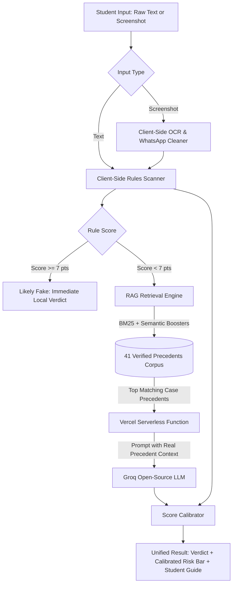

# ScamRadar for Interns 🛡️🔍

[](https://github.com/JosephJonathanFernandes/ScamRadar-for-Interns/actions/workflows/ci.yml)
[](https://github.com/JosephJonathanFernandes/ScamRadar-for-Interns)
[](https://nodejs.org/)
[](https://react.dev/)
[](LICENSE)

> **Is that internship offer real — or a scam?**  
> ScamRadar for Interns is an intelligent, privacy-first verification tool designed to protect college students and freshers from fraudulent internship offers, advance-fee traps, and identity-harvesting scams.

---

## 📌 The Problem

College students in India frequently receive forwarded internship opportunities on WhatsApp, Telegram, and LinkedIn. While some scams are blatant (asking for an upfront ₹500 registration fee), modern scams are subtle and psychologically manipulative:
- **Advance-Fee Disguises**: Requiring "refundable laptop security deposits", "training kit charges", or "exam certification fees".
- **Identity Harvesting**: Demanding Aadhaar card photos, PAN card numbers, and bank account IFSC codes before any real interview.
- **Thesaurus Evasion**: Bypassing naive keyword filters by renaming "registration fee" to "nominal onboarding contribution".
- **MNC & Brand Spoofing**: Impersonating Google, Wipro, or Infosys using fake domains or `@gmail.com` recruiter addresses.

ScamRadar was built to evaluate these offers instantly, combining **lightning-fast client-side pattern matching** with **precedent-grounded AI analysis (RAG)**.

---

## ⚡ Key Features

| Feature | Description |
|---|---|
| **⚡ Hybrid 2-Tier Engine** | Instant client-side regex rules catch blatant scams locally, reserving serverless LLM calls for ambiguous messages. |
| **📚 In-Memory RAG Architecture** | Dynamically retrieves the top matching precedents from a database of 41 verified real-world offers using BM25 and semantic signals. |
| **📷 Client-Side Screenshot OCR** | Paste text directly or drag-and-drop a WhatsApp screenshot. Uses `Tesseract.js` with contrast preprocessing and timestamp artifact cleaning. |
| **⚖️ Unified Score Calibration** | Synchronizes the 0–100% Risk Level progress bar, color styling, and verdict banner into a coherent assessment. |
| **🛑 Actionable Student Guidance** | Provides clear, jargon-free instructions on what to do immediately (e.g. blocking the sender, declining WhatsApp-only chats). |
| **📲 One-Click WhatsApp Warning** | Lets students copy formatted alert summaries to warn their college placement groups with one tap. |
| **🔄 Fault-Tolerant Key Rotation** | Dynamically discovers any number of Groq API keys and rotates automatically on rate limits (429) or timeouts. |

---

## 🏗️ Architecture Overview

ScamRadar utilizes a multi-stage evaluation pipeline to ensure fast verdicts, zero data leakage, and high precision:



To dive deeper into the technical design, see [docs/ARCHITECTURE.md](docs/ARCHITECTURE.md).

---

## 💻 Tech Stack

- **Frontend**: React 19, Vite, Tailwind CSS / Vanilla CSS design tokens.
- **OCR Engine**: Tesseract.js (runs 100% client-side inside the browser).
- **RAG Retrieval Engine**: In-memory BM25 scoring with inverse document frequency (IDF) and domain feature weighting.
- **Serverless Backend**: Vercel Serverless Function (`src/api/llm-check.js`).
- **LLM Provider**: Groq Cloud (`openai/gpt-oss-20b` or configurable via env).
- **Testing & Quality**: Vitest, Oxlint, Prettier.

---

## 📁 Repository Structure

```text
ScamRadar-for-Interns/
├── src/
│   ├── api/
│   │   └── llm-check.js         # Serverless function with dynamic Groq key rotation
│   ├── components/
│   │   ├── CheckerForm.jsx      # Input form supporting text paste and screenshot OCR
│   │   ├── ResultCard.jsx       # Verdict display, risk meter, RAG precedents & student checklist
│   │   ├── RedFlagsGuide.jsx    # Educational guide covering common scam categories
│   │   └── TestSuitePage.jsx    # Interactive developer test benchmark page
│   ├── core/
│   │   ├── scanner.js           # 9 client-side red-flag regex rules
│   │   ├── companyCheck.js      # Domain matching and web presence validation
│   │   ├── ocr.js               # Canvas image preprocessing & WhatsApp artifact cleaner
│   │   ├── scoreCalibrator.js   # Unified matrix aligning rules and LLM verdicts
│   │   └── rag/
│   │       ├── corpus.json      # Curated dataset of 41 verified scam & genuine cases
│   │       └── retriever.js     # BM25 + semantic feature retrieval engine
│   ├── App.jsx                  # Main application orchestrator
│   └── index.css                # Polished design system tokens and component styles
├── tests/
│   ├── unit/
│   │   ├── scanner.test.js      # Scanner rule benchmarks
│   │   ├── retriever.test.js    # RAG BM25 retrieval unit tests
│   │   ├── keys.test.js         # Dynamic key discovery and sequential rotation tests
│   │   └── calibrator.test.js   # Score calibrator unit tests
│   └── fixtures/
│       ├── validationData.json  # 30-case validation dataset
│       └── holdoutData.json     # 11-case holdout dataset
├── scripts/
│   ├── test_rag_pipeline.js     # End-to-end RAG verification script
│   ├── test_student_edge_cases.js # 15-case real-world student scenario evaluator
│   └── test_comprehensive_verification.js # Full 37-assertion integration test suite
├── docs/
│   ├── ARCHITECTURE.md          # In-depth architectural breakdown and rationale
│   └── walkthrough.md           # Engineering log of optimizations and test milestones
├── vite.config.js               # Dev server configuration and Vercel API proxy
└── package.json
```

---

## 🚀 Getting Started

### Prerequisites
- Node.js `v20.0.0` or higher
- npm `v10.0.0` or higher

### 1. Clone the Repository
```bash
git clone https://github.com/JosephJonathanFernandes/ScamRadar-for-Interns.git
cd ScamRadar-for-Interns
```

### 2. Install Dependencies
```bash
npm install
```

### 3. Configure API Keys
Copy the example environment file:
```bash
cp .env.example .env
```
Open `.env` and add your Groq API key(s). ScamRadar supports **any number of keys** and will automatically rotate across them on rate limits:
```env
# Single key:
GROQ_API_KEY=gsk_your_key_here

# OR multiple keys for automatic load balancing & rotation:
GROQ_KEY_1=gsk_key_one_here
GROQ_KEY_2=gsk_key_two_here
GROQ_KEY_3=gsk_key_three_here
GROQ_KEY_4=gsk_key_four_here
```
*(Note: If no API keys are provided, the app continues to operate using the client-side rule engine and graceful fallback).*

### 4. Start Development Server
```bash
npm run dev
```
Open [http://localhost:5173](http://localhost:5173) in your browser.

---

## 🧪 Testing & Validation

ScamRadar follows strict validation practices to prevent regressions and eliminate false alarms.

### Run All Unit Tests
```bash
npm test
```
Executes all 20 tests across scanner rules, RAG retrieval, dynamic key rotation, and score calibration.

### Run 15-Case Student Edge-Case Suite
```bash
node scripts/test_student_edge_cases.js
```
Validates the system against 15 real-world edge cases (Google ₹1.1L stipend, Telegram task scams, informal founder DMs, TPO announcements, etc.).

### Run Comprehensive Integration Suite
```bash
node scripts/test_comprehensive_verification.js
```
Runs 37 automated assertions covering key rotation, RAG ranking, calibrator thresholds, and HTTP proxy robustness.

### Production Build & Linting
```bash
npm run lint
npm run build
```

---

## 🔒 Privacy & Data Ethics

Students often paste sensitive offer messages. ScamRadar is designed with a strict privacy-first model:
1. **Local Processing First**: OCR and standard rule evaluations execute 100% locally within your browser.
2. **Metadata Stripping**: WhatsApp timestamps, phone numbers, and sender names are stripped before any secondary analysis.
3. **Zero Permanent Storage**: No user messages, uploaded screenshots, or analysis results are logged to a database or stored on disk.
4. **Bypass on Obvious Scams**: Messages confidently detected by client rules are never transmitted to external APIs.

For details, please review [SECURITY.md](SECURITY.md).

---

## 📄 License

This project is licensed under the MIT License — see the [LICENSE](LICENSE) file for details.