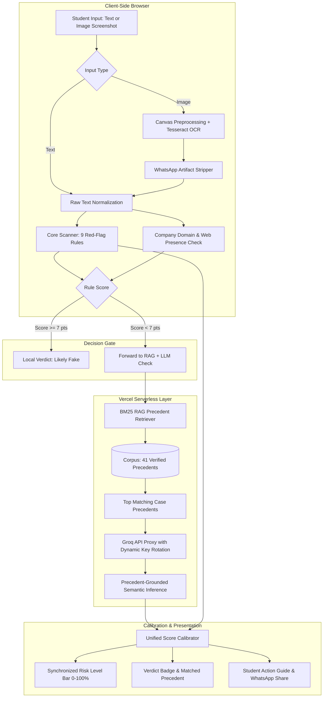

# ScamRadar for Interns — System Architecture

This document provides a technical deep-dive into the architectural design, algorithmic trade-offs, and engineering decisions behind **ScamRadar for Interns**.

---

## 1. Executive Summary

ScamRadar is engineered to resolve a core dilemma in automated scam detection:
- **Pure Rule-Based Systems** are fast, private, and deterministic, but brittle to semantic synonyms (e.g. replacing *"registration fee"* with *"nominal onboarding contribution"*).
- **Pure LLM-Based Systems** understand semantic nuance, but are slow, costly, privacy-invasive, and prone to "whack-a-mole" hallucination and rate-limit exhaustion.

ScamRadar implements a **Hybrid 5-Layer Pipeline**:
1. **Client-Side Scanner**: Evaluates 9 deterministic red-flag categories locally in < 5ms.
2. **Company Verification**: Performs asynchronous domain-matching and web presence validation.
3. **In-Memory RAG Retrieval**: Uses BM25 term weighting and semantic signals over 41 verified case precedents.
4. **Serverless LLM Analysis**: Conditions an open-source model on real retrieved precedents with multi-key rotation.
5. **Unified Score Calibrator**: Merges signals into a synchronized risk score (0–100%) and actionable student advice.

---

## 2. End-to-End Pipeline

---

## 3. Detailed Component Breakdown

### Layer 1: Client-Side Red-Flag Scanner (`src/core/scanner.js`)
Runs 100% locally in the browser with zero network latency:
- **Rule Categories & Weights**:
  - `payment_request` (Weight 5): Mandatory deposits, registration fees, training kit charges.
  - `sensitive_info` (Weight 4): Aadhaar, PAN card, or bank account IFSC harvesting.
  - `no_interview` (Weight 3): Direct selection with zero technical or behavioral assessment.
  - `personal_email` (Weight 3): Use of `@gmail`, `@yahoo`, or `@outlook` for corporate hiring.
  - `fake_social_proof` (Weight 3): Manufactured scarcity (e.g. repeated "Congratulations to X" spam).
  - `urgency_pressure` (Weight 2): False deadlines ("reply within 2 hours", "last chance").
  - `vague_role` (Weight 2): Generic data entry, copy-paste, or "easy tasks from home".
  - `unrealistic_pay` (Weight 2): Bait compensation (e.g. ₹1,500/day for freshers).
  - `link_obfuscation` (Weight 1): Generic URL shorteners (`bit.ly`, `tinyurl`).
- **Gatekeeper Decision**:
  - If a message triggers explicit payment demands or scores $\ge 7$ points, it is immediately declared **Likely Fake**. No external API calls are made, protecting student privacy and saving API quota.

---

### Layer 2: Company Verification (`src/core/companyCheck.js`)
Executes asynchronously in parallel with the scanner:
- **Entity Extraction**: Parses company names from email headers and body text.
- **Domain Matching**: Detects lookalike spoofing (e.g., claiming to be *"Infosys"* while emailing from `recruitment@infosys-careers-portal.com`).
- **Online Presence**: Queries the DuckDuckGo Instant Answer API to verify corporate legitimacy.

---

### Layer 3: In-Memory RAG Retrieval Engine (`src/core/rag/retriever.js`)

#### Why RAG Over Static Prompt Anchors?
Earlier iterations used static few-shot examples hardcoded directly into the system prompt. This created an acute **"whack-a-mole" problem**:
- Adding a static anchor for a ₹1.1L Google stipend fixed high-stipend MNC false positives, but biased the model to flag a legitimate remote content gig because of an urgency deadline.
- Static prompts cannot scale as new scam variations emerge without bloating context tokens.

#### The RAG Solution:
- **Knowledge Corpus (`src/core/rag/corpus.json`)**: Contains 41 curated and verified real-world offers (21 scams, 20 genuine offers) with category tags, ground truth verdicts, and plain-English rationales.
- **Algorithm**:
  - **BM25 Inverted Index**: Calculates term TF-IDF using standard parameters ($k1=1.5, b=0.75$).
  - **Semantic Feature Boosters**: Applies targeted multipliers for structural indicators:
    - *Fee indicators*: Boosts score if both query and precedent mention deposits/payments (+2.5).
    - *Identity indicators*: Boosts score if both mention Aadhaar/PAN/Bank IFSC (+2.5).
    - *High stipend scale*: Boosts matching for ₹50k–₹1.5L MNC compensation (+2.0).
    - *Communication channel*: Boosts matching for Telegram/WhatsApp patterns (+1.0).
  - **Execution**: Pure JavaScript in-memory indexing executing in $< 2\text{ms}$ with zero external vector database dependencies.

---

### Layer 4: Serverless LLM Check & Fault-Tolerant Key Rotation (`src/api/llm-check.js`)
- **Dynamic Key Discovery**: Scans `process.env` dynamically for any number of keys (`GROQ_API_KEY`, `GROQ_KEY`, `GROQ_KEY_1`, `GROQ_KEY_2`, etc.).
- **Sequential Key Rotation**:
  - Tries Key 1. If Groq returns `429 Too Many Requests`, `401 Unauthorized`, or times out after 12s, it automatically rotates to Key 2, Key 3, and so on.
  - Graceful degradation: If all keys fail, the API returns `{ llmAvailable: false }` without crashing the client.
- **Prompt Injection**: Injects the top 3 retrieved precedents as verified reference cases, asking the model to determine whether the candidate message resembles known scam tactics or legitimate hiring procedures.

---

### Layer 5: Unified Score Calibrator (`src/core/scoreCalibrator.js`)
To prevent conflicting UI outputs (such as the AI warning of a scam while the rule bar displays a green 16% score):
- **Calibration Matrix**:
  - **LLM = Fake**: Calibrates verdict to `Likely Fake` and elevates risk to $\ge 80\% - 95\%$ (Red bar).
  - **LLM = Suspicious**: Calibrates verdict to `Suspicious` and sets risk to $52\% - 65\%$ (Amber bar).
  - **LLM = Genuine**: If rules only triggered minor noise (e.g. conversational tone), risk is lowered to $\le 16\%$ (Green bar).
  - **Safety Override**: If an upfront payment request was detected by rules, it strictly remains `Likely Fake` regardless of LLM output.

---

### Layer 6: Student Action Guidance & WhatsApp Alert Engine
- **Actionable Advice**: Displays customized instructions immediately below the verdict:
  - *Fake*: Never pay upfront, do not share IDs, block the sender, warn classmates.
  - *Suspicious*: Search official career portal directly, demand `@company.com` email, decline text-only chats.
  - *Genuine*: Safe to share resume/portfolio, retain tax IDs until official appointment letter.
- **WhatsApp Share Button**: Generates a clean, formatted plain-text alert for students to copy and paste into their college placement groups.

---

## 4. Privacy & Security Posture

1. **Zero Client Storage**: Messages and uploaded images are never stored in `localStorage`, cookies, or browser caches.
2. **Metadata Sanitization**: `src/core/ocr.js` strips WhatsApp header timestamps, phone numbers, and profile names before text analysis.
3. **Selective Transmission**: Blatant scams (e.g. ₹500 registration fee) are caught locally and **never sent over the network**.
4. **No Server Logging**: Serverless functions process payloads ephemerally in memory; zero database writes or logging of candidate texts.

---

## 5. Performance Benchmarks

| Operation | Typical Latency | Mechanism |
|---|---|---|
| Rule Scanner Analysis | `< 5 ms` | In-browser regex evaluation |
| Image OCR & Cleaning | `600 - 1200 ms` | In-browser WebAssembly Tesseract.js |
| RAG BM25 Retrieval | `< 2 ms` | In-memory JavaScript vector index |
| Groq LLM Generation | `800 - 2500 ms` | Serverless proxy over LPUs |
| Total End-to-End Analysis | `~1.5 - 3.0 s` | Parallel execution + early local exits |
