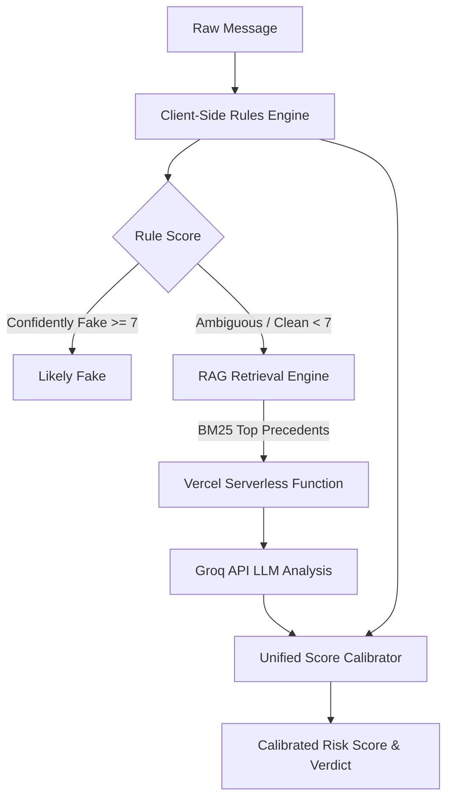

# ScamRadar for Interns: Architecture

ScamRadar for Interns uses a hybrid scanning approach to detect fraudulent internship offers. This document explains how the pipeline works and why we built it this way.

## The Hybrid Pipeline

### 1. The Client-Side Rules Engine (`src/core/scanner.js`)
The first layer is a fast, offline, Regex-based scanner. It looks for known structural red flags, such as:
- Requests for upfront payments or deposits
- Artificially urgent deadlines ("Reply within 2 hours")
- Direct selection without an interview

### 2. The Company Verification Layer (`src/core/companyCheck.js`)
This layer runs concurrently with the rule scanner. It extracts the company name and email domain from the text to perform two checks:
- **Domain Similarity Check**: Flags emails that use suspicious variations of the company name (e.g., `@infosys-careers-india.com`).
- **Web Presence Check**: Pings DuckDuckGo's Instant Answer API to confirm the company has a verifiable web presence.

### 3. The RAG Precedent Retrieval Engine (`src/core/rag/retriever.js`)
To avoid "whack-a-mole" overfitting from static few-shot prompt anchors, ScamRadar employs an in-memory RAG (Retrieval-Augmented Generation) engine:
- **Corpus (`src/core/rag/corpus.json`)**: Indexes 41 verified real-world internship offers (known scams and verified genuine offers).
- **BM25 & Semantic Boosters**: Computes term IDF and matches structural signals (upfront fee keywords, Aadhaar/PAN requests, MNC stipend scales, Telegram/WhatsApp channels).
- **Dynamic Context**: Extracts the top matching precedents to pass into the LLM system prompt as reference ground truth.

### 4. The LLM Semantic Check (`src/api/llm-check.js`)
The rule engine is effective at catching obvious structural scams. However, an adversarial audit demonstrated that rules are susceptible to semantic evasion (the **"Thesaurus Bypass"**). For instance, replacing "registration fee" with "nominal onboarding contribution" results in a perfect 0 score from regex rules.

To solve this without unnecessary overhead:
- If a message **confidently fails** the rules engine (Likely Fake), we reject it locally to save costs and protect privacy.
- If a message is **anything else**, we forward the text and retrieved RAG precedents to our Vercel Serverless Function, which queries an Open-Source LLM (`openai/gpt-oss-20b`) via Groq for precedent-grounded semantic analysis.

### 5. Unified Score Calibrator (`src/core/scoreCalibrator.js`)
To prevent contradictory UI outputs (e.g. AI detecting a scam while the rule bar displays low risk):
- The calibrator merges rule-based red flag detections with LLM semantic verdicts and RAG similarity.
- Synchronizes the Risk Level percentage, progress bar track color, and main verdict banner into a single coherent assessment.

## LLM API Key Rotation
To stay within the rate limits of Groq's free tier, our Serverless Function implements dynamic key discovery and rotation:
- Scans `process.env` dynamically for any number of keys (`GROQ_API_KEY`, `GROQ_KEY`, `GROQ_API_KEY_*`, `GROQ_KEY_*`), supporting 1, 2, or more keys.
- If a key throws `429 Too Many Requests`, `401 Unauthorized`, or times out after 12s, the handler catches the error and rotates to the next available key.
- Keys are never exposed to the browser client.

## Test Coverage
The project maintains full Vitest coverage across all core modules:
- `tests/unit/scanner.test.js`: Core regex rules and validation dataset benchmarks.
- `tests/unit/retriever.test.js`: BM25 tokenization, stopword filtering, and precedent retrieval.
- `tests/unit/keys.test.js`: Dynamic environment variable discovery, deduplication, and numeric sorting.
- `tests/unit/calibrator.test.js`: Unified scoring matrix and threshold calibration.
