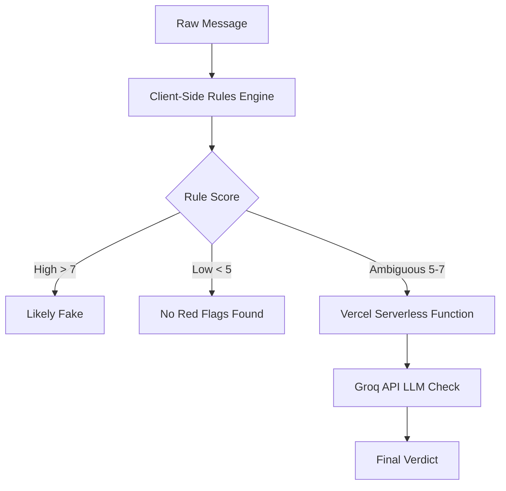

# ScamRadar for Interns: Architecture

ScamRadar for Interns uses a hybrid scanning approach to detect fraudulent internship offers. This document explains how the pipeline works and why we built it this way.

## The Hybrid Pipeline

### 1. The Client-Side Rules Engine (`src/core/scanner.js`)
The first layer is a fast, offline, Regex-based scanner. It looks for known structural red flags, such as:
- Requests for upfront payments or deposits
- Artificially urgent deadlines ("Reply within 2 hours")
- Direct selection without an interview

### 2. The Company Verification Layer (`src/core/companyCheck.js`)
This layer runs concurrently with the rule scanner. It extracts the company name and email domain from the text to perform two checks:
- **Domain Similarity Check**: Flags emails that use suspicious variations of the company name (e.g., `@infosys-careers-india.com`).
- **Web Presence Check**: Pings DuckDuckGo's Instant Answer API to confirm the company has a verifiable web presence.

### 3. The LLM Fallback (`src/api/llm-check.js`)
The rule engine is extremely effective at catching obvious scams (like explicit payment requests). However, a holdout test demonstrated that the rule-engine only had a **40% hit rate** on scams that rely on subtle psychological manipulation (e.g. vague data entry jobs with no explicit fee).

To bridge this gap without sending every request to an LLM, we use a hybrid model:
- If a message clearly fails the rules engine, we reject it locally to save costs and protect privacy.
- If a message is **ambiguous**, we forward the text to our Vercel Serverless Function, which queries an Open-Source LLM (`openai/gpt-oss-20b`) via Groq for a secondary opinion. This increased our holdout hit-rate from 40% to **100%**.

## LLM API Key Rotation
To stay within the rate limits of Groq's free tier, our Serverless Function implements a round-robin key rotation strategy. 
- If a key throws a `429 Too Many Requests` or `401 Unauthorized`, the proxy silently catches the error and moves to the next key in the pool.
- The keys are stored in environment variables (`GROQ_API_KEY_1`, `GROQ_API_KEY_2`, etc.) and are never exposed to the client.

## Test Coverage Recommendation
For future contributors, a test coverage of **70-80%** on the `src/core/` directory is highly recommended. The core rules and company verification logic are pure functions and are straightforward to unit test using Vitest.
